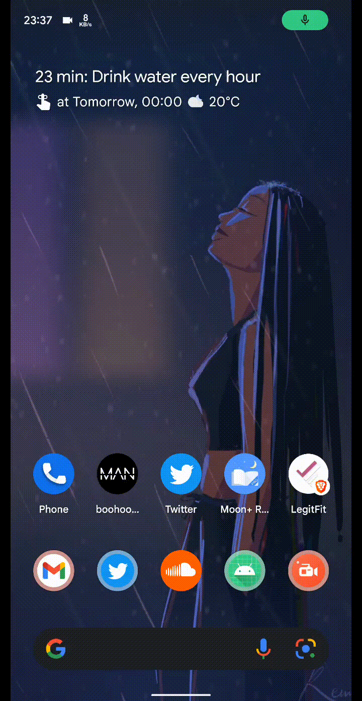
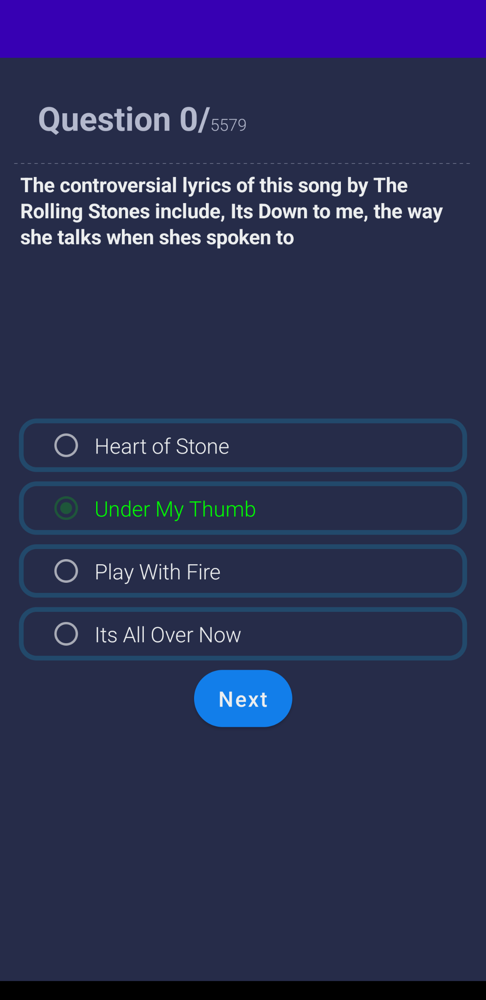
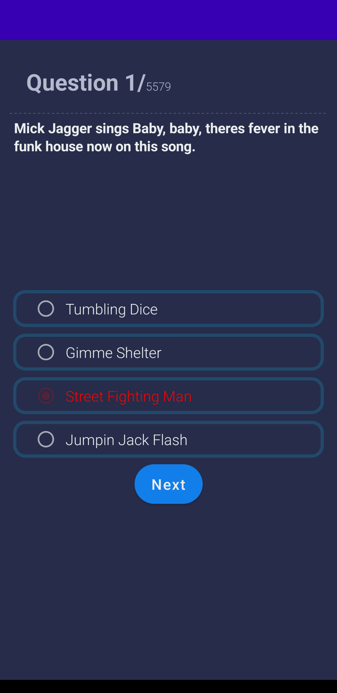
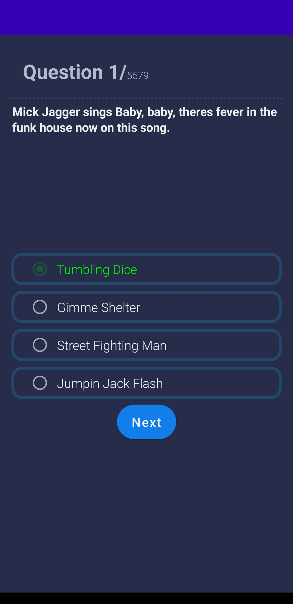
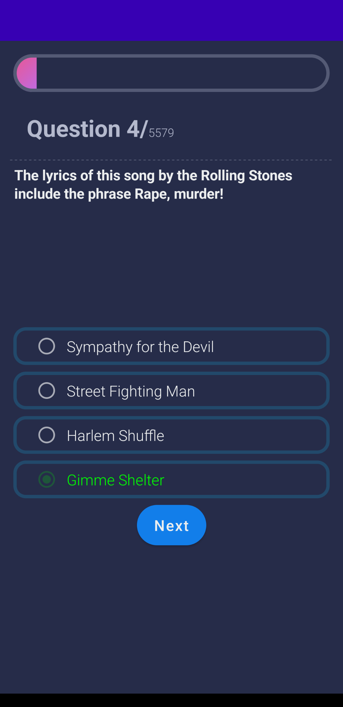
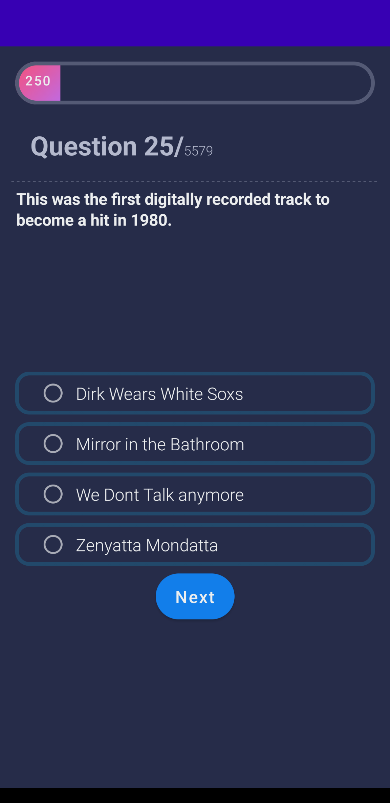

Trivia Application based on the Udemy course - Android Jetpack Compose: The Comprehensive Bootcamp \[2022]

Contains modified code and makes use of:

- Compose
- Coroutines
- Retrofit
- ViewModel
- Dagger Hilt
- Repository Pattern
- MVVM
- MutableState

    

     
    
     

     
    

